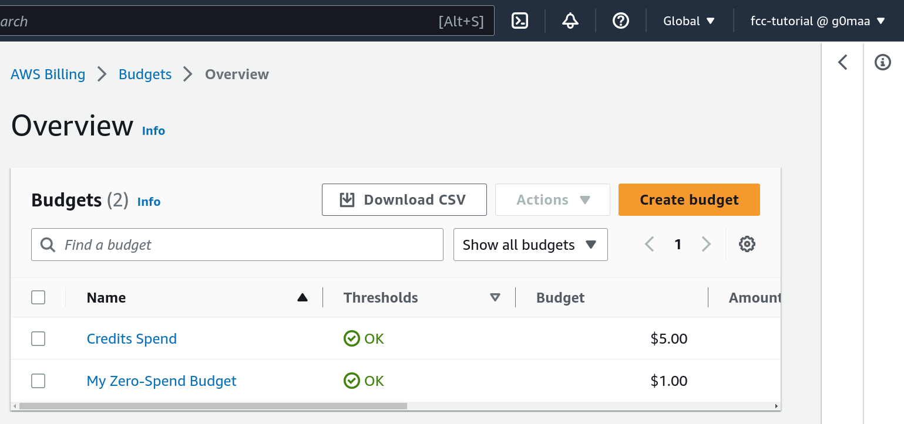
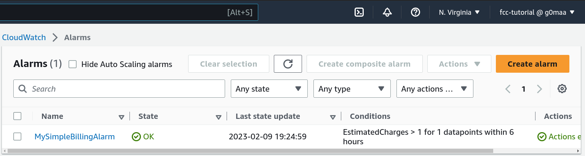

# Week 0 — Billing and Architecture

- (Pictures include `fcc-tutorial` Admin account)
## AWS Budget

## AWS Alarm

## Concetual Diagram
- https://lucid.app/lucidchart/c3239b22-71d6-4bf1-9a4c-eb4dd2a599e2/edit?invitationId=inv_87bfcb4a-3354-4c48-a521-a769074e8ab0

## Logical Diagram
- https://lucid.app/lucidchart/7e9add98-0b36-4605-bf55-6e7ec9ebe5f2/edit?invitationId=inv_7f4fd7b0-0888-4485-affe-fa456efe1644

# References (for someone wondering what is this?)
- This is some of the homework of AWS Bootcamp, outline: https://docs.google.com/document/d/19XMyd5zCk7S9QT2q1_Cg-wvbnBwOge7EgzgvtVCgcz0/edit?usp=sharing
