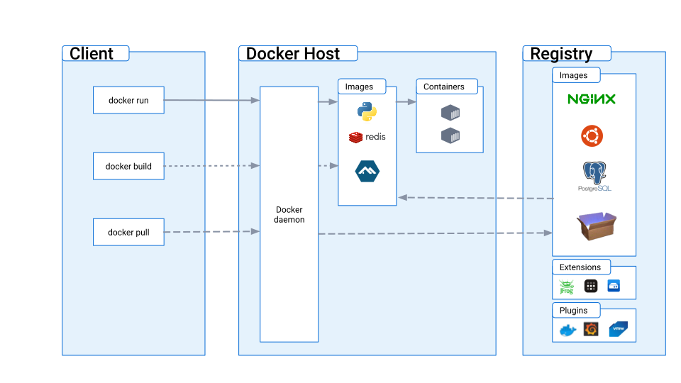

# Week 1 — App Containerization
- Check `bills`, `free tier` & `Gitpod` weeky.
- What will be graded is the `main` branch.
- Why are we containerizing our apps?
	- Quickly setup the same development/production environment for all.
- DockerHub
	- Container registery for hosting docker images, public or private.
	- there are other ones. OCI Open Container Initiative.
- `Dockerfile`
	- contains instructions to create the image,
	- mostly coming from the desired environment steps to start the app.
	- `FROM` pulls the image from `DockerHub`.
		- The image `Dockerfile` could contain other `FROM`s...
		- Till you get to `FROM scratch` which is an official empty docker image
	- Each command is a layer.
	- `WORKDIR`  the directory which the commands work on in the **container**. (probably the default one too as in `cd`)
	- `COPY` from outside to inside.
	- `RUN` command run inside the container, setup process.
	- `ENV`
	- `EXPOSE`
	- `CMD`, the command used to run the app when the container starts.
- Building the image
	- `docker built -t <image-name>:<tag> <location of dockerfile>`
- running the container
	- `docker run --rm -p <hostPort>:>containerPort> -it -e envVar -d <image-name>`
		- `--rm` removed after stopping the containr
- `docker exec -it <container-id> bash` run bash in the container
- Using `docker compose`
	- `docker compose up`
- Docker compose makes it easier to deal with containers especially a group of them.
- In VMs it's guest OS, in docker it's docker engine, i.e. it's the base of everything.
	- VMs => Hypervisor
	- OS-Level virtualization => Containers
		- The linux kernel is the shared layer.
# Spending Considerations
- Gitpod (free):
	- 50 hours/month
	- 4 Cores, 8GB Ram & 30 GB Storage
- Github Codespaces
	- 60 hours/month: 2 Cores 4 GB Ram 15 Gigs of storage
	- 30 hours/month: 4 cores 8 GB Ram 15 GB of storage
	- Students: 180 hours / month
- AWS Cloud9
	- Uses EC2 instance.
# Security Considerations
- Docker Architecture

- Best practices
	- Keep Docker & Host updated.
	- Deamon & Containers should run in non-root user mode.
	- Limit size & resources available to the docker image
		-  10MB to 100MB image size `huh?`
	- No sensetive data in dockerfiles or images,
		- use Secret Management Services to share secrets.
	- Limit the long-term storage you are using on the container
		- Keep the end-result (container & volumes?) read-only.
		- e.g. use RDS
	- Scan for vulnurabilites (in code, `dockerfile`, & images)
		- e.g. Snyk for dockerfile (it has other stuff)
		- AWS Inspector for the image itself
---
# Observations
- Contenarizing the frontend depends on `npm intsall` on the main os, which isn't really correct.
	- While I tried to fix it, by isolating `node_modules` in `docker-compose`, it lead to more problems, so I just returned to the given solution.
	- Use of multi-stage containarization
- So far, modern day development process has (each is a different service):
	- Software Development "Framework", e.g. Kanban
	- Logging & Incident Tracking e.g. ElasticSearch frameowork
	- Secret Managers e.g. AWS Secrets Manager & Hashicorp
	- Version Control System i.e. Git & GitHub
	- Complex CI/CD Pipelines e.g. Jenkins
	- Issue Tracking e.g. (not always on GitHub)
	- Code Analysis e.g. SonarQube
	- Security Analysis e.g. SonarQube & Snyk
	- Communication e.g. Slack & Discord
- Lots of the services these days
	- are Freemium (partially free, more features for money)
	- or Entierly free but you have to host it yourself, and there's an option for paid cloud host.
- It seems like having a "truly" offline development environment is impossible these days 🤨
# Questions
- I'm confused about how docker works VS VMs
	- The middle layer between host OS and guest OS is hypervisor,
	- VMs virtualize much more stuff.
	- The middle layer between host OS and containers are "container deamon"
	- virtualizeation is as minimal as possible
- Why `host=0.0.0.0` in containers?
	- i.e. anywhere (not just localhost), can access the app.
---
# To-Dos
- How to import settings from local VS Code to Gitpod.
- How are secrets shared in containers?
	- e.g. AWS Secrets Manager, Hashicorp Vault
- Read:
	- https://www.toptal.com/ruby-on-rails/rails-service-objects-tutorial
	- https://en.wikipedia.org/wiki/Object%E2%80%93role_modeling
---
# Refernces
- Video Link
	- https://www.youtube.com/live/zJnNe5Nv4tE?feature=share
- Repo | Check Branches of Week-1
	- https://github.com/omenking/aws-bootcamp-cruddur-2023/
